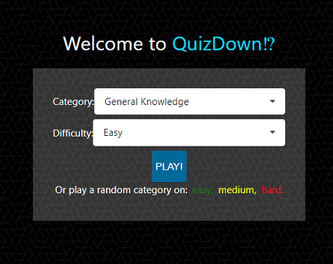
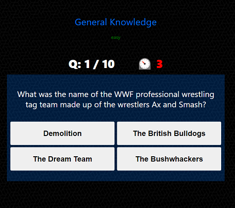

# QUIZDown⁉

> New 3.0 version being built with NextJS.

## [PLAY!](https://quizdown.vercel.app)

- Still a work in progress.
- See and play with QuizDown V2.0 [here](https://quiz-down.herokuapp.com/).

## Description:

Timed quiz with penalty for wrong answers and points added to your final score for correct ones.

## How to Play:

- Choose from one of over 20 categories! Select a difficulty and click PLAY to begin.
- Or, if you're feeling spicy, click on one of the 3 available difficulties to select a category at random.
- A timer will begin and a series of questions will be asked. Answer correctly and you'll be rewarded with points added to your score. Get it wrong and you lose points! So choose carefully. And watch the clock, once it runs out the choices are disabled and you will be awarded 0 points (womp womp). So hurry!
- Have fun!

<!-- ## Hi Score List

- A final screen appears at the end of the game where you can enter your initials and save the score. You can also view any previous scores ranked highest-to-lowest for the category and difficulty played. -->

## Built With

- [Next.js](https://nextjs.org/) - React framework
- [MongoDB](https://www.mongodb.com/) - NoSQL Database
- [Semantic UI React](https://react.semantic-ui.com/) - UI development framework
- [Node.js](https://nodejs.org/en/) - JavaScript runtime
- [Passport](http://www.passportjs.org/) - Authentication middleware
- [NPM](https://www.npmjs.com/) - Dependency management

## Planned updates

- High-scores page (filterable by category/difficulty)
- Adding T/F questions
- Add sound fx / music

## Credits

[Nextjs-mongodb-app](https://github.com/hoangvvo/nextjs-mongodb-app) - App boiler plate created by [Hoang Vo](https://hoangvvo.com/)

### Copyright 2020-2021 \\\\ Gus Valenzuela
